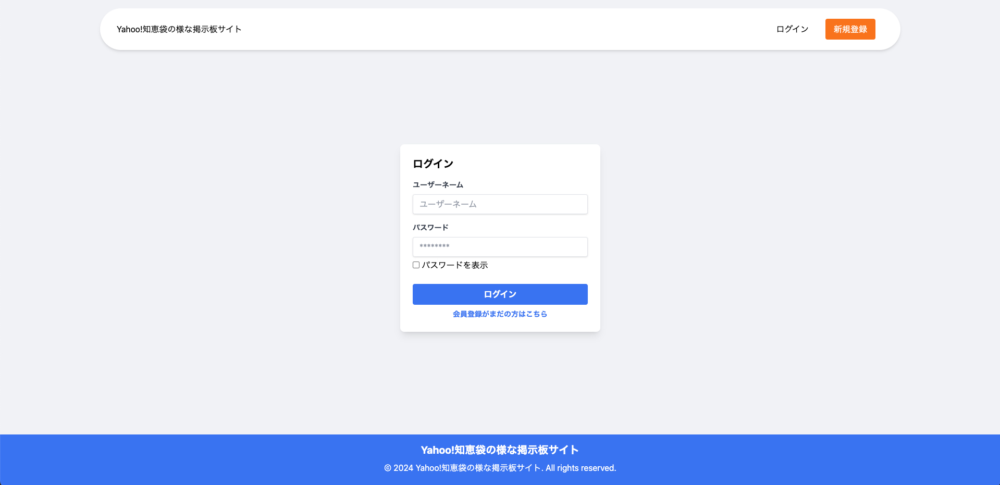
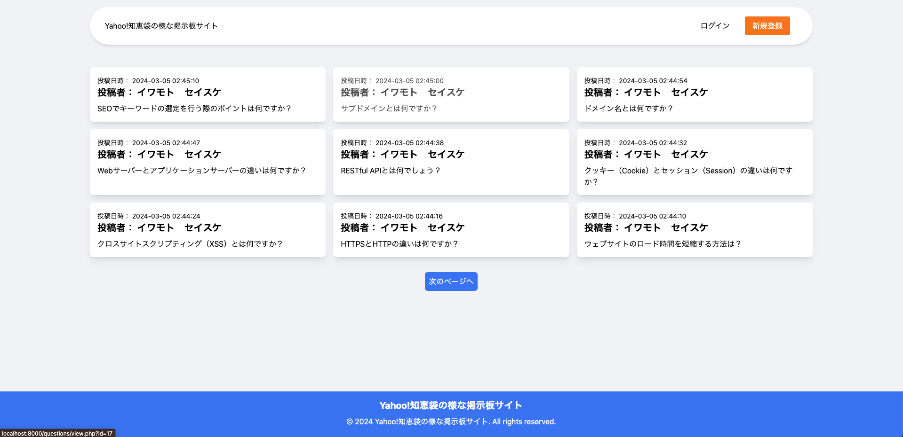

# 概要  
Yahoo!知恵袋を参考に掲示板サイトを作成

> ログイン画面



> 質問一覧画面



# 使用技術


 

# 掲示板の機能一覧
- 会員登録 
- ログイン、ログアウト 
- ニックネームの変更 
- パスワード更新 
- 投稿
- 投稿の削除
- 投稿に対する回答
- 回答の削除

# 環境構築

> Dockerのインストール
  
**※インストール済みの方は飛ばしてください。**

[Dockerをインストールする](https://www.docker.com/)

> Dockerコンテナ起動

```
docker-compose up -d
```

> Tailwind.css起動（実行しないとHTMLにclassを指定してもCSSが反映されません）

```
npm start
```

> Yahoo!知恵袋の様な掲示板サイトへのアクセス

```
http://localhost:8000/questions
```

> phpMyAdminへのアクセス

```
http://localhost:8080
```